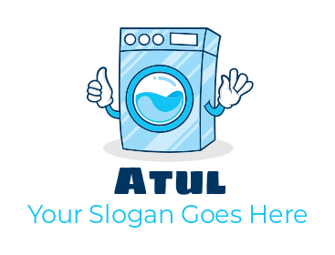

# Atul_Vaishya_Task5

This is a Laundry Website.
We developed this with HTML and CSS.
It shows the satisfying Output.
# HTML code file----

------------------------*----------------*----------------*-----------------*-------------------
<!DOCTYPE html>
<html lang="en">
<head>
    <meta charset="UTF-8">
    <meta name="viewport" content="width=device-width, initial-scale=1.0">
    <title>CSS Hero Section: Display, Position, Float</title>
    <LINK rel="stylesheet" href="style.css">
</head>
<body>
    <!-- NAV BAAR SECTION -->
     

        

            
        

        
    
            <a href="#">Home</a>
            <a href="#">Services</a>
            <a href="#">About Us</a>
            <a href="#">Contact</a>
        

        

            <button>User</button>
        

     

    <!-- Hero Section -->

    

        

            <h1>We fight stains, not battles.</h1>
            <h2>“I think a laundromat slogan needs to promise a result and a timeframe in just a few words, like 'Clean clothes, fast.'</h2>
            <button>Book a Service Today!</button>
        

        

            
        

    

</body>
</html>

# CSS code file ----

-----------*--------------*---------------*----------------*--------------------*-----------------------

*{
    box-sizing: border-box;
    margin: 0;
    padding: 0;
}

body{
    width: 100vw;
    height: 100vh;
    background-color: #f8f9fa;
}

.nav-bar{
    width: 100vw;
    height: 10vh;
    background-color: rgba(11, 12, 19, 0.24);
    /* overflow: hidden; */
}

img{
    width: 10vw;
    height: 10vh;
    float: left;
}

.tab{
    /* display: inline-block; */
    text-align: center;
    font-size: 30px;
    color: rgb(162, 26, 211);
    margin-right: 30px;
    padding-top: 10px;
    padding-left: 5vw;
    /* padding-right: 5vw; */
   
    /* float: center; */
    

}

.tab a{
    font-size: 3vh bold;
    color: rgb(67, 138, 161);
    padding-left: 20px;
    padding-right: 50px;

    /* vertical-align: middle; */
}

button{
    display: inline-block;
    width: 15vh;
    height: 70px;
    background-color: rgb(192, 214, 233);
    float: right;
    font-size: 3vh;
    padding-top: 0%;
    border-radius: 5px;
}

.btn{
    margin-top: -50px;
}

.hero{
    display: inline-block;
}

.left{
    float: left;
    width: 50vw;
    height: 80vh;
}

.left h1{
    font-size: 80px;
    color: rgb(28, 78, 103);
    font-family: 'Times New Roman', Times, serif;
    padding: 20px;
    margin-top: 20px;
}

.left h2{
    font-size: 70px bold;
    font-family: Verdana, Geneva, Tahoma, sans-serif;
    color: rgba(7, 50, 36, 0.518);
    margin-top: 10px;
}

.left button{
    float: left;
    width: 20vw;
    height: 15vh;
    background-color: rgb(21, 21, 154);
    color: white;
    border-radius: 12px;
    margin-top: 70px;
    margin-left: 70px;
}

.left button:hover{
    background-color: rgb(86, 86, 195);
}

.right{
    float: right;
    width: 50vw;
    height: 80vh;
    padding-top: 20px;
}

.right img{
    height: 600px;
    width: 600px;
}

# OutPut ----

# Link - https://atulvaishyatask5.netlify.app/

